```mermaid
flowchart TB
    subgraph current["BugTrackerUI.Tests.csproj"]
        MAIN["<b>📦&nbsp;BugTrackerUI.Tests.csproj</b><br/><small>net9.0</small>"]
        click MAIN "#bugtrackeruitestsbugtrackeruitestscsproj"
    end
    subgraph downstream["Dependencies (1"]
        P4["<b>📦&nbsp;BugTrackerUI.csproj</b><br/><small>net9.0</small>"]
        click P4 "#bugtrackeruibugtrackeruicsproj"
    end
    MAIN --> P4

```

```mermaid
flowchart TB
    subgraph upstream["Dependants (1)"]
        P5["<b>📦&nbsp;BugTrackerUI.Tests.csproj</b><br/><small>net9.0</small>"]
        click P5 "#bugtrackeruitestsbugtrackeruitestscsproj"
    end
    subgraph current["BugTrackerUI.csproj"]
        MAIN["<b>📦&nbsp;BugTrackerUI.csproj</b><br/><small>net9.0</small>"]
        click MAIN "#bugtrackeruibugtrackeruicsproj"
    end
    P5 --> MAIN

```

```mermaid
flowchart TB
    subgraph upstream["Dependants (2)"]
        P2["<b>📦&nbsp;CarvedRock.Api.csproj</b><br/><small>net9.0</small>"]
        P3["<b>📦&nbsp;CarvedRock.BlazorServerSide.csproj</b><br/><small>net9.0</small>"]
        click P2 "#carvedrockapicarvedrockapicsproj"
        click P3 "#carvedrockblazorserversidecarvedrockblazorserversidecsproj"
    end
    subgraph current["CarvedRock.Admin.csproj"]
        MAIN["<b>📦&nbsp;CarvedRock.Admin.csproj</b><br/><small>net9.0</small>"]
        click MAIN "#carvedrockadmincarvedrockadmincsproj"
    end
    P2 --> MAIN
    P3 --> MAIN

```

```mermaid
flowchart TB
    subgraph current["CarvedRock.Api.csproj"]
        MAIN["<b>📦&nbsp;CarvedRock.Api.csproj</b><br/><small>net9.0</small>"]
        click MAIN "#carvedrockapicarvedrockapicsproj"
    end
    subgraph downstream["Dependencies (1"]
        P1["<b>📦&nbsp;CarvedRock.Admin.csproj</b><br/><small>net9.0</small>"]
        click P1 "#carvedrockadmincarvedrockadmincsproj"
    end
    MAIN --> P1

```

```mermaid
flowchart TB
    subgraph current["CarvedRock.BlazorServerSide.csproj"]
        MAIN["<b>📦&nbsp;CarvedRock.BlazorServerSide.csproj</b><br/><small>net9.0</small>"]
        click MAIN "#carvedrockblazorserversidecarvedrockblazorserversidecsproj"
    end
    subgraph downstream["Dependencies (1"]
        P1["<b>📦&nbsp;CarvedRock.Admin.csproj</b><br/><small>net9.0</small>"]
        click P1 "#carvedrockadmincarvedrockadmincsproj"
    end
    MAIN --> P1

```

# Projects and dependencies analysis

This document provides a comprehensive overview of the projects and their dependencies in the context of upgrading to .NETCoreApp,Version=v10.0.

## Table of Contents

- [Executive Summary](#executive-Summary)
  - [Highlevel Metrics](#highlevel-metrics)
  - [Projects Compatibility](#projects-compatibility)
  - [Package Compatibility](#package-compatibility)
  - [API Compatibility](#api-compatibility)
- [Aggregate NuGet packages details](#aggregate-nuget-packages-details)
- [Top API Migration Challenges](#top-api-migration-challenges)
  - [Technologies and Features](#technologies-and-features)
  - [Most Frequent API Issues](#most-frequent-api-issues)
- [Projects Relationship Graph](#projects-relationship-graph)
- [Project Details](#project-details)

  - [BugTrackerUI.Tests\BugTrackerUI.Tests.csproj](#bugtrackeruitestsbugtrackeruitestscsproj)
  - [BugTrackerUI\BugTrackerUI.csproj](#bugtrackeruibugtrackeruicsproj)
  - [CarvedRock.Admin\CarvedRock.Admin.csproj](#carvedrockadmincarvedrockadmincsproj)
  - [CarvedRock.Api\CarvedRock.Api.csproj](#carvedrockapicarvedrockapicsproj)
  - [CarvedRock.BlazorServerSide\CarvedRock.BlazorServerSide.csproj](#carvedrockblazorserversidecarvedrockblazorserversidecsproj)

## Executive Summary

### Highlevel Metrics

| Metric | Count | Status |
| :--- | :---: | :--- |
| Total Projects | 5 | All require upgrade |
| Total NuGet Packages | 21 | 13 need upgrade |
| Total Code Files | 161 |  |
| Total Code Files with Incidents | 8 |  |
| Total Lines of Code | 7635 |  |
| Total Number of Issues | 31 |  |
| Estimated LOC to modify | 7+ | at least 0.1% of codebase |

### Projects Compatibility

| Project | Target Framework | Difficulty | Package Issues | API Issues | Est. LOC Impact | Description |
| :--- | :---: | :---: | :---: | :---: | :---: | :--- |
| [BugTrackerUI.Tests\BugTrackerUI.Tests.csproj](#bugtrackeruitestsbugtrackeruitestscsproj) | net9.0 | 🟢 Low | 3 | 0 |  | DotNetCoreApp, Sdk Style = True |
| [BugTrackerUI\BugTrackerUI.csproj](#bugtrackeruibugtrackeruicsproj) | net9.0 | 🟢 Low | 0 | 1 | 1+ | AspNetCore, Sdk Style = True |
| [CarvedRock.Admin\CarvedRock.Admin.csproj](#carvedrockadmincarvedrockadmincsproj) | net9.0 | 🟢 Low | 12 | 5 | 5+ | AspNetCore, Sdk Style = True |
| [CarvedRock.Api\CarvedRock.Api.csproj](#carvedrockapicarvedrockapicsproj) | net9.0 | 🟢 Low | 2 | 0 |  | AspNetCore, Sdk Style = True |
| [CarvedRock.BlazorServerSide\CarvedRock.BlazorServerSide.csproj](#carvedrockblazorserversidecarvedrockblazorserversidecsproj) | net9.0 | 🟢 Low | 2 | 1 | 1+ | AspNetCore, Sdk Style = True |

### Package Compatibility

| Status | Count | Percentage |
| :--- | :---: | :---: |
| ✅ Compatible | 8 | 38.1% |
| ⚠️ Incompatible | 2 | 9.5% |
| 🔄 Upgrade Recommended | 11 | 52.4% |
| ***Total NuGet Packages*** | ***21*** | ***100%*** |

### API Compatibility

| Category | Count | Impact |
| :--- | :---: | :--- |
| 🔴 Binary Incompatible | 0 | High - Require code changes |
| 🟡 Source Incompatible | 4 | Medium - Needs re-compilation and potential conflicting API error fixing |
| 🔵 Behavioral change | 3 | Low - Behavioral changes that may require testing at runtime |
| ✅ Compatible | 28178 |  |
| ***Total APIs Analyzed*** | ***28185*** |  |

## Aggregate NuGet packages details

| Package | Current Version | Suggested Version | Projects | Description |
| :--- | :---: | :---: | :--- | :--- |
| Azure.Identity | 1.13.1 |  | [CarvedRock.Admin.csproj](#carvedrockadmincarvedrockadmincsproj) | ⚠️NuGet package is deprecated |
| coverlet.collector | 6.0.2 |  | [BugTrackerUI.Tests.csproj](#bugtrackeruitestsbugtrackeruitestscsproj) | ✅Compatible |
| FluentValidation.AspNetCore | 11.3.0 |  | [CarvedRock.Admin.csproj](#carvedrockadmincarvedrockadmincsproj) | ⚠️NuGet package is deprecated |
| HtmlAgilityPack | 1.11.66 |  | [BugTrackerUI.Tests.csproj](#bugtrackeruitestsbugtrackeruitestscsproj) | ✅Compatible |
| Microsoft.AspNetCore.Components | 9.0.0-rc.1.24452.1 | 10.0.1 | [BugTrackerUI.Tests.csproj](#bugtrackeruitestsbugtrackeruitestscsproj) | NuGet package upgrade is recommended |
| Microsoft.AspNetCore.Identity.EntityFrameworkCore | 9.0.0-rc.1.24452.1 | 10.0.1 | [CarvedRock.Admin.csproj](#carvedrockadmincarvedrockadmincsproj) | NuGet package upgrade is recommended |
| Microsoft.AspNetCore.Identity.UI | 9.0.0-rc.1.24452.1 | 10.0.1 | [CarvedRock.Admin.csproj](#carvedrockadmincarvedrockadmincsproj) | NuGet package upgrade is recommended |
| Microsoft.EntityFrameworkCore.Design | 9.0.0-rc.1.24451.1 | 10.0.1 | [CarvedRock.Admin.csproj](#carvedrockadmincarvedrockadmincsproj) | NuGet package upgrade is recommended |
| Microsoft.EntityFrameworkCore.Sqlite | 9.0.0-rc.1.24451.1 | 10.0.1 | [CarvedRock.Admin.csproj](#carvedrockadmincarvedrockadmincsproj) | NuGet package upgrade is recommended |
| Microsoft.EntityFrameworkCore.SqlServer | 9.0.0-rc.1.24451.1 | 10.0.1 | [CarvedRock.Admin.csproj](#carvedrockadmincarvedrockadmincsproj) | NuGet package upgrade is recommended |
| Microsoft.EntityFrameworkCore.Tools | 9.0.0-rc.1.24451.1 | 10.0.1 | [CarvedRock.Admin.csproj](#carvedrockadmincarvedrockadmincsproj) | NuGet package upgrade is recommended |
| Microsoft.Extensions.Caching.Memory | 9.0.0-rc.1.24431.7 | 10.0.1 | [CarvedRock.Admin.csproj](#carvedrockadmincarvedrockadmincsproj) [CarvedRock.Api.csproj](#carvedrockapicarvedrockapicsproj) [CarvedRock.BlazorServerSide.csproj](#carvedrockblazorserversidecarvedrockblazorserversidecsproj) | NuGet package upgrade is recommended |
| Microsoft.NET.Test.Sdk | 17.11.1 |  | [BugTrackerUI.Tests.csproj](#bugtrackeruitestsbugtrackeruitestscsproj) | ✅Compatible |
| Microsoft.VisualStudio.Web.CodeGeneration.Design | 9.0.0-rc.1.24457.2 | 10.0.1 | [CarvedRock.Admin.csproj](#carvedrockadmincarvedrockadmincsproj) | NuGet package upgrade is recommended |
| Swashbuckle.AspNetCore | 6.9.0 |  | [CarvedRock.Api.csproj](#carvedrockapicarvedrockapicsproj) | ✅Compatible |
| System.Formats.Asn1 | 8.0.1 | 10.0.1 | [CarvedRock.Admin.csproj](#carvedrockadmincarvedrockadmincsproj) | NuGet package upgrade is recommended |
| System.Net.Http | 4.3.4 |  | [BugTrackerUI.Tests.csproj](#bugtrackeruitestsbugtrackeruitestscsproj) | NuGet package functionality is included with framework reference |
| System.Text.Json | 8.0.5 | 10.0.1 | [CarvedRock.Admin.csproj](#carvedrockadmincarvedrockadmincsproj) [CarvedRock.Api.csproj](#carvedrockapicarvedrockapicsproj) [CarvedRock.BlazorServerSide.csproj](#carvedrockblazorserversidecarvedrockblazorserversidecsproj) | NuGet package upgrade is recommended |
| System.Text.RegularExpressions | 4.3.1 |  | [BugTrackerUI.Tests.csproj](#bugtrackeruitestsbugtrackeruitestscsproj) | NuGet package functionality is included with framework reference |
| xunit | 2.9.1 |  | [BugTrackerUI.Tests.csproj](#bugtrackeruitestsbugtrackeruitestscsproj) | ✅Compatible |
| xunit.runner.visualstudio | 2.8.2 |  | [BugTrackerUI.Tests.csproj](#bugtrackeruitestsbugtrackeruitestscsproj) | ✅Compatible |

## Top API Migration Challenges

### Technologies and Features

| Technology | Issues | Percentage | Migration Path |
| :--- | :---: | :---: | :--- |

### Most Frequent API Issues

| API | Count | Percentage | Category |
| :--- | :---: | :---: | :--- |
| M:Microsoft.AspNetCore.Builder.ExceptionHandlerExtensions.UseExceptionHandler(Microsoft.AspNetCore.Builder.IApplicationBuilder,System.String) | 3 | 42.9% | Behavioral Change |
| T:Microsoft.Extensions.DependencyInjection.IdentityServiceCollectionUIExtensions | 1 | 14.3% | Source Incompatible |
| M:Microsoft.Extensions.DependencyInjection.IdentityServiceCollectionUIExtensions.AddDefaultIdentity''1(Microsoft.Extensions.DependencyInjection.IServiceCollection,System.Action{Microsoft.AspNetCore.Identity.IdentityOptions}) | 1 | 14.3% | Source Incompatible |
| T:Microsoft.Extensions.DependencyInjection.IdentityEntityFrameworkBuilderExtensions | 1 | 14.3% | Source Incompatible |
| M:Microsoft.Extensions.DependencyInjection.IdentityEntityFrameworkBuilderExtensions.AddEntityFrameworkStores''1(Microsoft.AspNetCore.Identity.IdentityBuilder) | 1 | 14.3% | Source Incompatible |

## Projects Relationship Graph

Legend:
📦 SDK-style project
⚙️ Classic project

```mermaid
flowchart LR
    P1["<b>📦&nbsp;CarvedRock.Admin.csproj</b><br/><small>net9.0</small>"]
    P2["<b>📦&nbsp;CarvedRock.Api.csproj</b><br/><small>net9.0</small>"]
    P3["<b>📦&nbsp;CarvedRock.BlazorServerSide.csproj</b><br/><small>net9.0</small>"]
    P4["<b>📦&nbsp;BugTrackerUI.csproj</b><br/><small>net9.0</small>"]
    P5["<b>📦&nbsp;BugTrackerUI.Tests.csproj</b><br/><small>net9.0</small>"]
    P2 --> P1
    P3 --> P1
    P5 --> P4
    click P1 "#carvedrockadmincarvedrockadmincsproj"
    click P2 "#carvedrockapicarvedrockapicsproj"
    click P3 "#carvedrockblazorserversidecarvedrockblazorserversidecsproj"
    click P4 "#bugtrackeruibugtrackeruicsproj"
    click P5 "#bugtrackeruitestsbugtrackeruitestscsproj"

```

## Project Details

### BugTrackerUI.Tests\BugTrackerUI.Tests.csproj

#### Project Info

- **Current Target Framework:** net9.0
- **Proposed Target Framework:** net10.0
- **SDK-style**: True
- **Project Kind:** DotNetCoreApp
- **Dependencies**: 1
- **Dependants**: 0
- **Number of Files**: 33
- **Number of Files with Incidents**: 1
- **Lines of Code**: 928
- **Estimated LOC to modify**: 0+ (at least 0.0% of the project)

#### Dependency Graph

Legend:
📦 SDK-style project
⚙️ Classic project

### API Compatibility

| Category | Count | Impact |
| :--- | :---: | :--- |
| 🔴 Binary Incompatible | 0 | High - Require code changes |
| 🟡 Source Incompatible | 0 | Medium - Needs re-compilation and potential conflicting API error fixing |
| 🔵 Behavioral change | 0 | Low - Behavioral changes that may require testing at runtime |
| ✅ Compatible | 1113 |  |
| ***Total APIs Analyzed*** | ***1113*** |  |

### BugTrackerUI\BugTrackerUI.csproj

#### Project Info

- **Current Target Framework:** net9.0
- **Proposed Target Framework:** net10.0
- **SDK-style**: True
- **Project Kind:** AspNetCore
- **Dependencies**: 0
- **Dependants**: 1
- **Number of Files**: 30
- **Number of Files with Incidents**: 2
- **Lines of Code**: 140
- **Estimated LOC to modify**: 1+ (at least 0.7% of the project)

#### Dependency Graph

Legend:
📦 SDK-style project
⚙️ Classic project

### API Compatibility

| Category | Count | Impact |
| :--- | :---: | :--- |
| 🔴 Binary Incompatible | 0 | High - Require code changes |
| 🟡 Source Incompatible | 0 | Medium - Needs re-compilation and potential conflicting API error fixing |
| 🔵 Behavioral change | 1 | Low - Behavioral changes that may require testing at runtime |
| ✅ Compatible | 866 |  |
| ***Total APIs Analyzed*** | ***867*** |  |

### CarvedRock.Admin\CarvedRock.Admin.csproj

#### Project Info

- **Current Target Framework:** net9.0
- **Proposed Target Framework:** net10.0
- **SDK-style**: True
- **Project Kind:** AspNetCore
- **Dependencies**: 0
- **Dependants**: 2
- **Number of Files**: 132
- **Number of Files with Incidents**: 2
- **Lines of Code**: 6418
- **Estimated LOC to modify**: 5+ (at least 0.1% of the project)

#### Dependency Graph

Legend:
📦 SDK-style project
⚙️ Classic project

### API Compatibility

| Category | Count | Impact |
| :--- | :---: | :--- |
| 🔴 Binary Incompatible | 0 | High - Require code changes |
| 🟡 Source Incompatible | 4 | Medium - Needs re-compilation and potential conflicting API error fixing |
| 🔵 Behavioral change | 1 | Low - Behavioral changes that may require testing at runtime |
| ✅ Compatible | 25209 |  |
| ***Total APIs Analyzed*** | ***25214*** |  |

### CarvedRock.Api\CarvedRock.Api.csproj

#### Project Info

- **Current Target Framework:** net9.0
- **Proposed Target Framework:** net10.0
- **SDK-style**: True
- **Project Kind:** AspNetCore
- **Dependencies**: 1
- **Dependants**: 0
- **Number of Files**: 3
- **Number of Files with Incidents**: 1
- **Lines of Code**: 53
- **Estimated LOC to modify**: 0+ (at least 0.0% of the project)

#### Dependency Graph

Legend:
📦 SDK-style project
⚙️ Classic project

### API Compatibility

| Category | Count | Impact |
| :--- | :---: | :--- |
| 🔴 Binary Incompatible | 0 | High - Require code changes |
| 🟡 Source Incompatible | 0 | Medium - Needs re-compilation and potential conflicting API error fixing |
| 🔵 Behavioral change | 0 | Low - Behavioral changes that may require testing at runtime |
| ✅ Compatible | 145 |  |
| ***Total APIs Analyzed*** | ***145*** |  |

### CarvedRock.BlazorServerSide\CarvedRock.BlazorServerSide.csproj

#### Project Info

- **Current Target Framework:** net9.0
- **Proposed Target Framework:** net10.0
- **SDK-style**: True
- **Project Kind:** AspNetCore
- **Dependencies**: 1
- **Dependants**: 0
- **Number of Files**: 26
- **Number of Files with Incidents**: 2
- **Lines of Code**: 96
- **Estimated LOC to modify**: 1+ (at least 1.0% of the project)

#### Dependency Graph

Legend:
📦 SDK-style project
⚙️ Classic project

### API Compatibility

| Category | Count | Impact |
| :--- | :---: | :--- |
| 🔴 Binary Incompatible | 0 | High - Require code changes |
| 🟡 Source Incompatible | 0 | Medium - Needs re-compilation and potential conflicting API error fixing |
| 🔵 Behavioral change | 1 | Low - Behavioral changes that may require testing at runtime |
| ✅ Compatible | 845 |  |
| ***Total APIs Analyzed*** | ***846*** |  |

